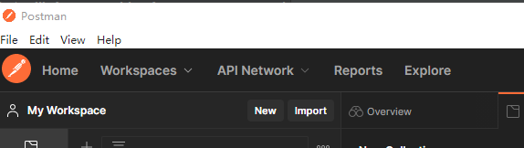
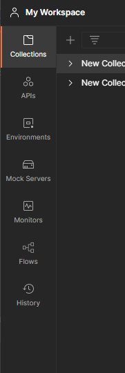
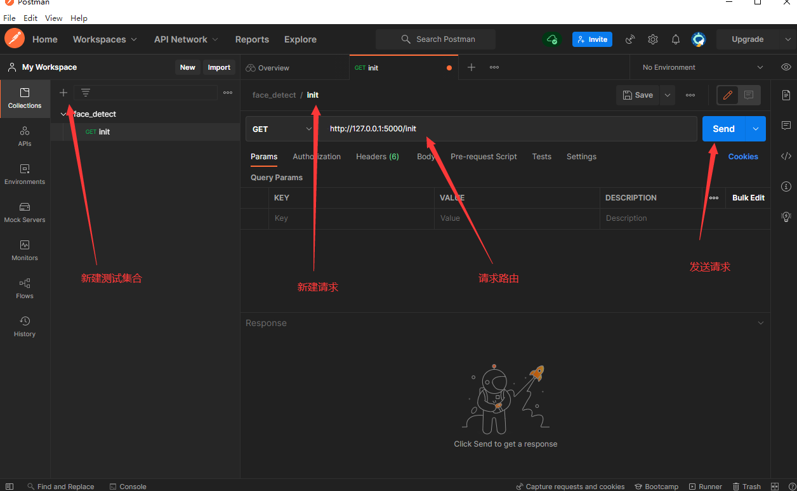
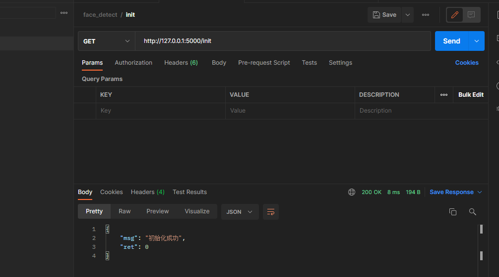
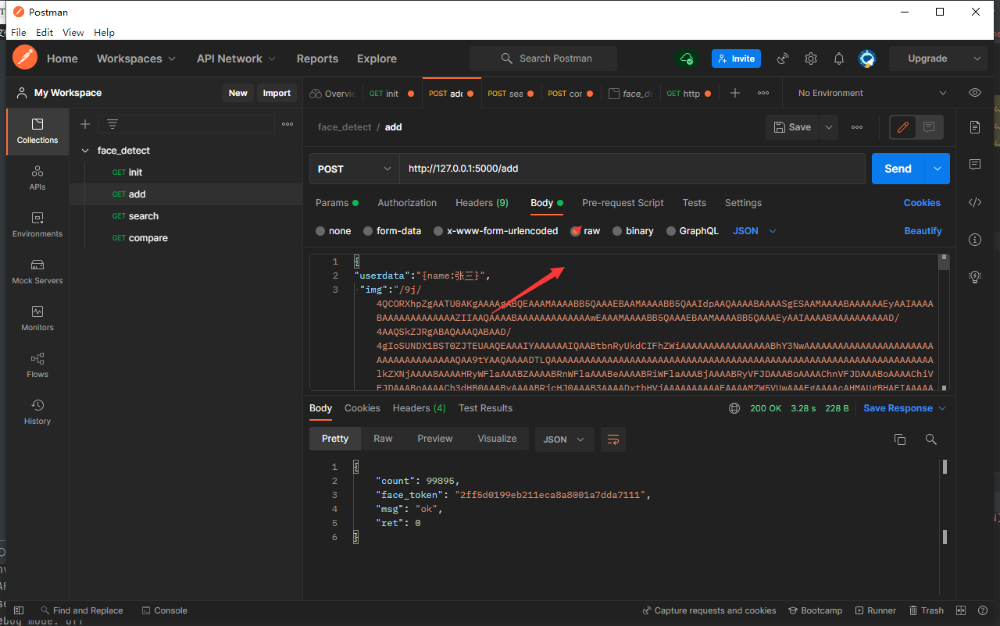
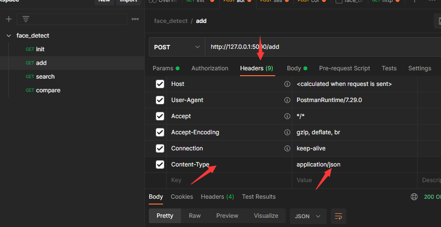

## Postman简单学习

### 功能模块

- **workspace 工作空间

  - Collections         集合，项目集合
  - APIs  API            文档

  - Environments     环境变量
  - Mock Server       虚拟服务器
  - Monitors             监听器
  - Flows
  - History                请求历史记录

### 基本操作

测试结果

