人脸识别项目运行

先把pip 更新到最新

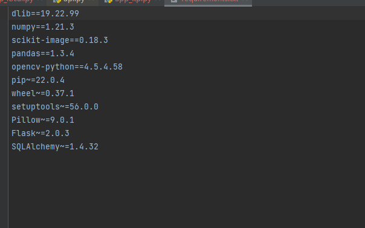

此处的重点问题是dlib，dlib安装需要CMake、VS等前置条件，故直接找whl文件本地安装（需要先安装wheel）

学长原先适配的是python 3.7 的，dlib-19.17.0-cp37-cp37m-win_amd64.whl

我的用的是3.9  19.17.0的dlib不适配

pip debug --verbose用于查看当前Python版本匹配

故选用了19.22.99

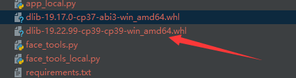

然后安装tensorflow后出现ModuleNotFoundError: No module named 'tensorflow.python.keras.applications'

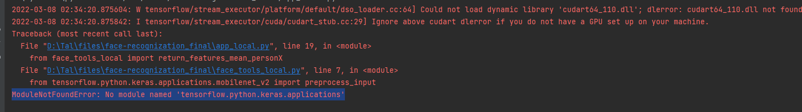

一开始认为是keras与tensorflow版本不兼容导致

后来发现当前版本tensorflow内置的'tensorflow.python.keras.‘下没有applications文件夹】

但是单独安装的keras里面有，并且含有所需要的函数文件

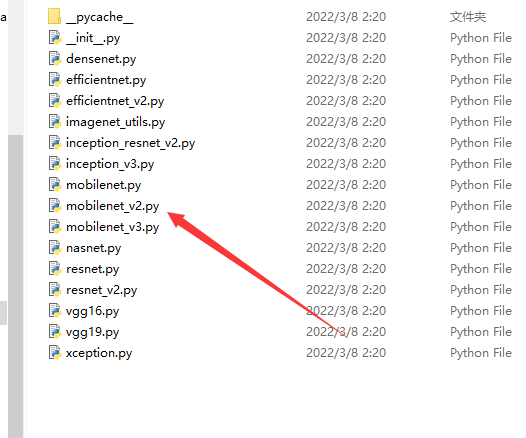

故将face_tools_local.py文件下的tensorflow.python.keras.前缀改为keras.

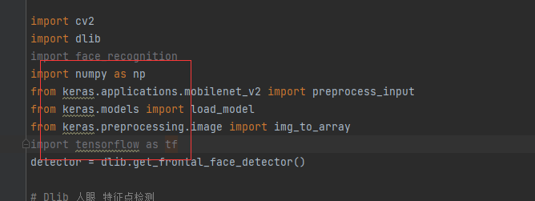

至此，成功运行

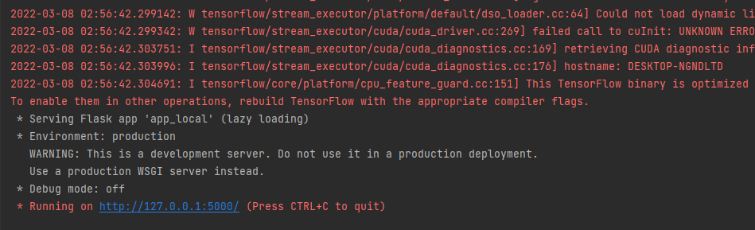

根据路由里的初始化操作，需要导入数据库

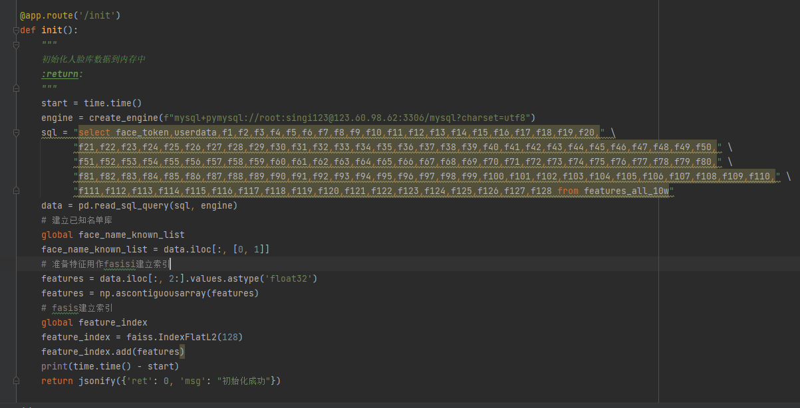

初步运行之后，init操作时提示没有安装mysql模块，安装

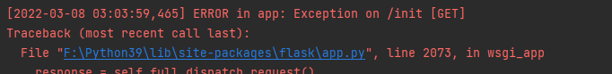

数据库导入数据

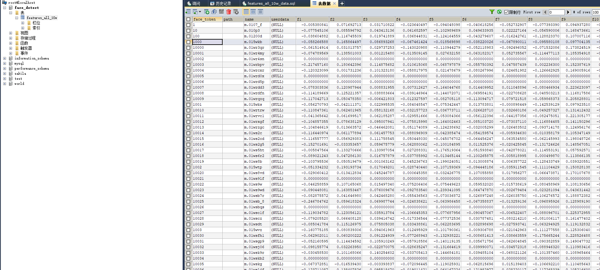

更改mysql地址

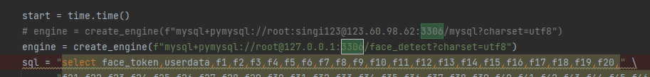

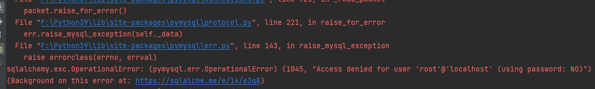

错误原因：未输入密码

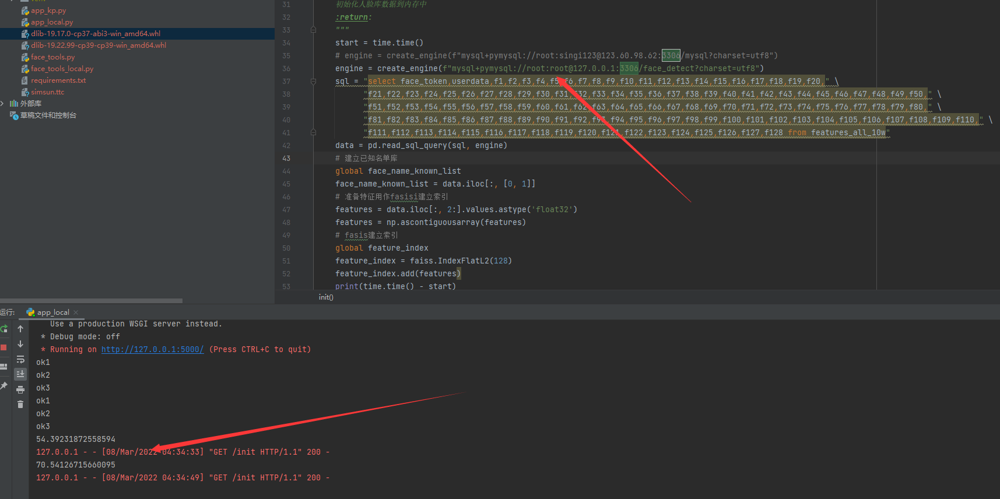

init初始化测试成功

search操作时研究读取图片信息时，发现cv2中缺少方法

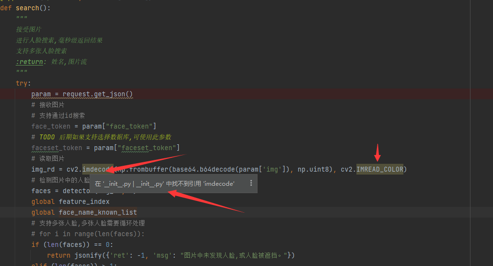

卸载opencv-python，安装最新版

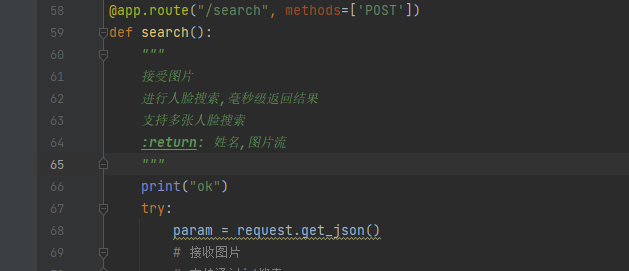

测试发现并没有执行方法

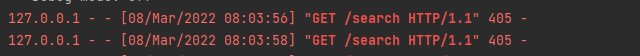

405错误是由于get/post 弄混了

调整之后可以成功进入相应的方法

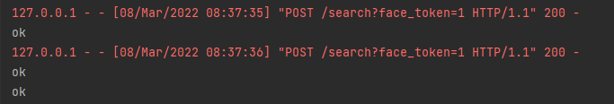

图片使用BASE64转码工具转成数据流，需要在header里添加application/json

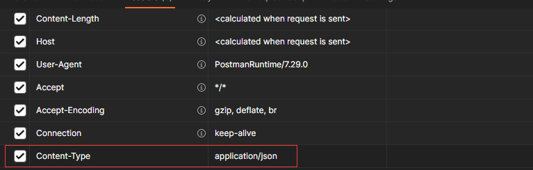

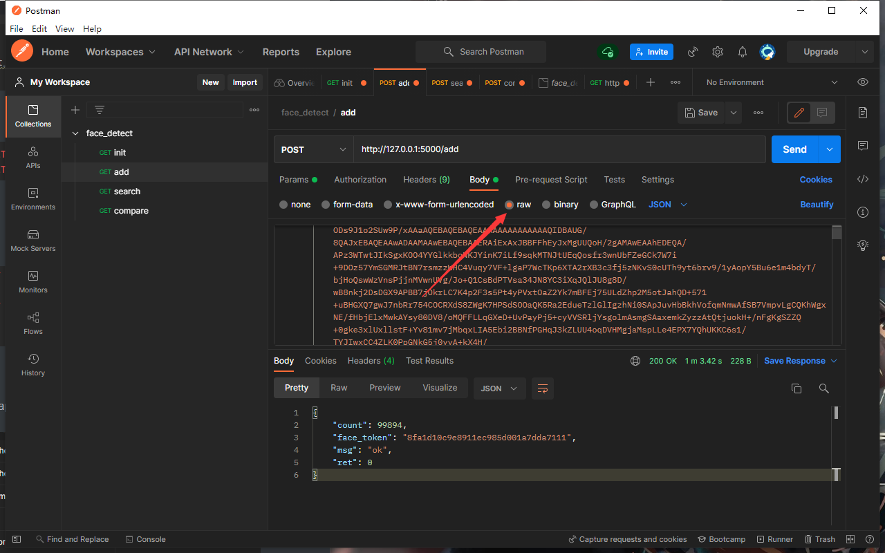