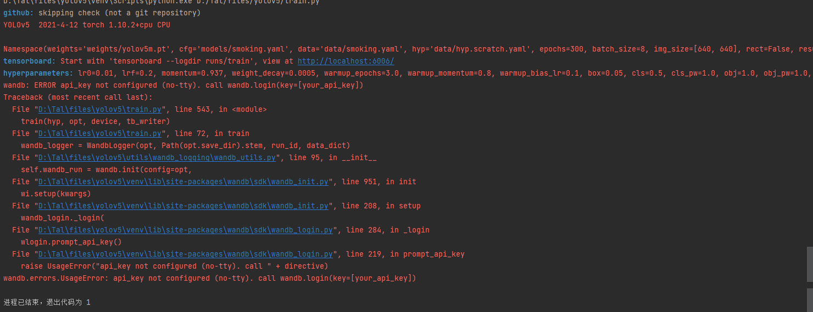
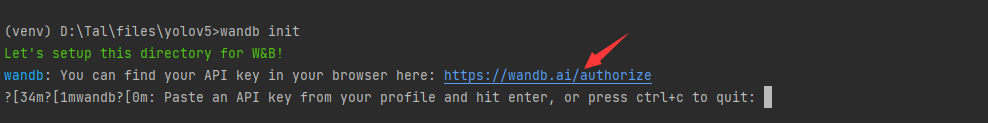
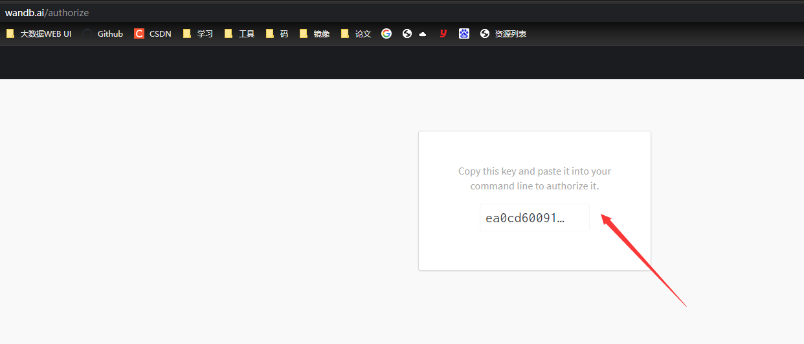
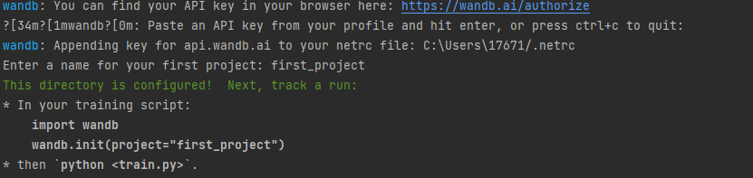
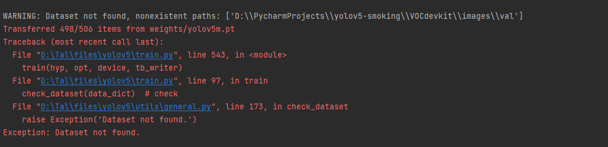
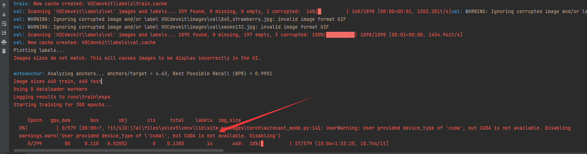
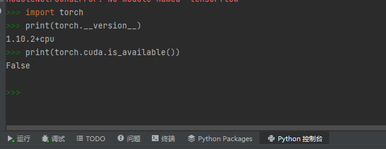
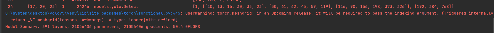
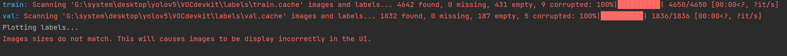
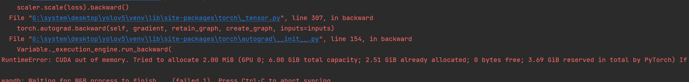

抽烟识别demo复现

python3.9环境下

```shell
# pip install -r requirements.txt

# base ----------------------------------------
matplotlib>=3.2.2
numpy>=1.18.5
opencv-python>=4.1.2
Pillow
PyYAML>=5.3.1
scipy>=1.4.1 #
torch>=1.7.0
torchvision>=0.8.1
tqdm>=4.41.0

# logging -------------------------------------
tensorboard>=2.4.1
# wandb

# plotting ------------------------------------
seaborn>=0.11.0
pandas

# export --------------------------------------
coremltools>=4.1
onnx>=1.8.1
scikit-learn==0.19.2  # for coreml quantization

# extras --------------------------------------
thop  # FLOPS computation
pycocotools>=2.0  # COCO mAP   #
```

安装包时主要遇到的问题在pycocotools上，安装pycocotools_windows无效

在网上直接找到编译后的包放在解释器site-packages下，解决

运行train.py 报如下错误，为wandb问题



解决方法

```cmd
wandb init
```





注意粘贴在控制台的时候没有显示，直接enter就行，该问题解决



重新运行train.py,数据集问题，更改路径即可



运行之后如下图所示，可以看到cuda存在问题不可用



```python
import torch
print(torch.__version__)
print(torch.cuda.is_available())
```

查看cuda与torch是否匹配使用（无显卡将cuda要进行更换）




在笔记本上重新导入工程时，出现以下错误

dis...... 没有version 属性 ，将matplotlib和numpy降至旧版本即可解决

更新torch匹配cuda版本

运行train.py





以上两个问题可以不用管



修改batch-size的default值为4 即可

