玩手机检测demo复现

根据README文件，先去下载了数据集，然后运行phone_down_download.py文件

发现找不到pycocotools._mask, 上个项目的pycocotools出了问题，下载VS2019后可以直接用pip install

（vs2019安装时勾选使用C++的桌面开发和MSVC......2015C++生成工具）

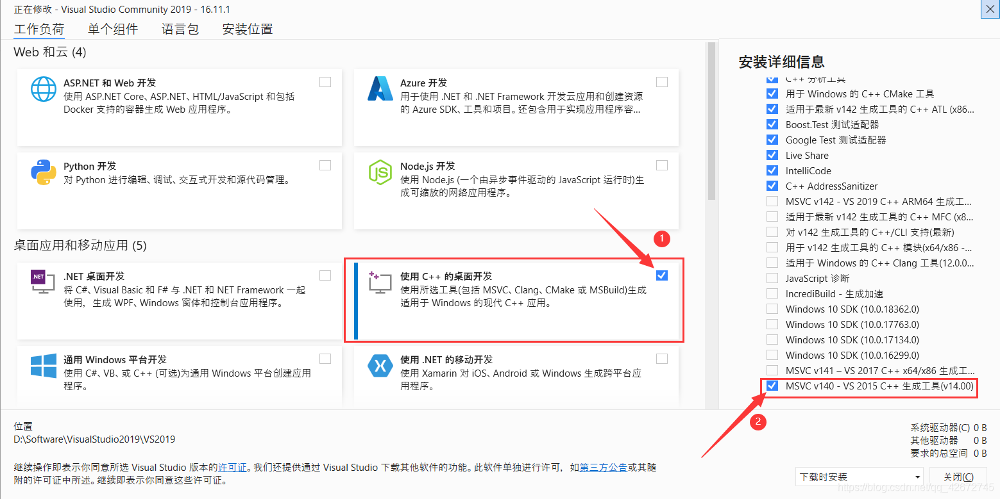

然后运行报错

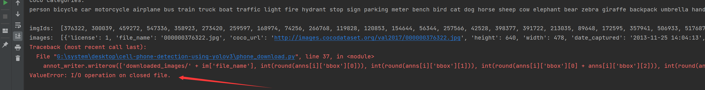

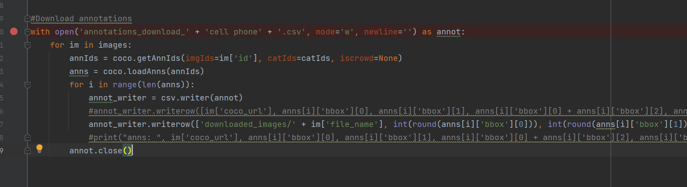

调试发现只读取了一张图片，

检查发现annot.close()缩进不对，更改后正常运行

运行savetxt.py

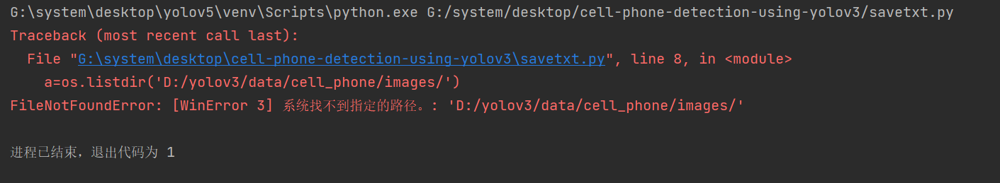

修改下载路径

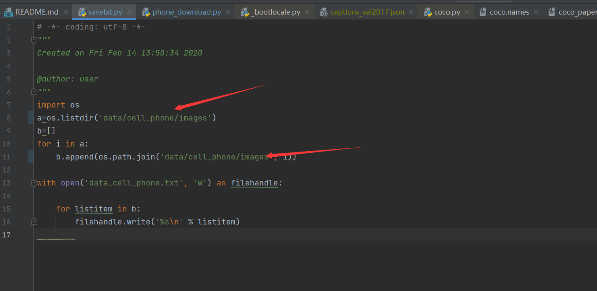


coco数据集提取所需的类

重新编写函数coco_use.py

```python
from pycocotools.coco import COCO
import os
import shutil
from tqdm import tqdm
import skimage.io as io
import matplotlib.pyplot as plt
import cv2
from PIL import Image, ImageDraw

# the path you want to save your results for coco to voc
savepath = "data/coco/"  # 保存提取类的路径,我放在同一路径下
img_dir = savepath + 'images/'
anno_dir = savepath + 'annotations/'
# datasets_list=['train2014', 'val2014']
datasets_list = ['train2017']

classes_names = ['cell phone']  # coco有80类，这里写要提取类的名字，以person为例
# Store annotations and train2014/val2014/... in this folder
dataDir = 'coco_source/'  # 原coco数据集

headstr = """\
<annotation>
    <folder>VOC</folder>
    <filename>%s</filename>
    <source>
        <database>My Database</database>
        <annotation>COCO</annotation>
        <image>flickr</image>
        <flickrid>NULL</flickrid>
    </source>
    <owner>
        <flickrid>NULL</flickrid>
        <name>company</name>
    </owner>
    <size>
        <width>%d</width>
        <height>%d</height>
        <depth>%d</depth>
    </size>
    <segmented>0</segmented>
"""
objstr = """\
    <object>
        <name>%s</name>
        <pose>Unspecified</pose>
        <truncated>0</truncated>
        <difficult>0</difficult>
        <bndbox>
            <xmin>%d</xmin>
            <ymin>%d</ymin>
            <xmax>%d</xmax>
            <ymax>%d</ymax>
        </bndbox>
    </object>
"""

tailstr = '''\
</annotation>
'''


# if the dir is not exists,make it,else delete it
def mkr(path):
    if os.path.exists(path):
        shutil.rmtree(path)
        os.mkdir(path)
    else:
        os.mkdir(path)


mkr(img_dir)
mkr(anno_dir)


def id2name(coco):
    classes = dict()
    for cls in coco.dataset['categories']:
        classes[cls['id']] = cls['name']
    return classes


def write_xml(anno_path, head, objs, tail):
    f = open(anno_path, "w")
    f.write(head)
    for obj in objs:
        f.write(objstr % (obj[0], obj[1], obj[2], obj[3], obj[4]))
    f.write(tail)


def save_annotations_and_imgs(coco, dataset, filename, objs):
    # eg:COCO_train2014_000000196610.jpg-->COCO_train2014_000000196610.xml
    anno_path = anno_dir + filename[:-3] + 'xml'
    img_path = dataDir + dataset + '/' + filename
    print(img_path)
    dst_imgpath = img_dir + filename

    img = cv2.imread(img_path)
    # if (img.shape[2] == 1):
    #    print(filename + " not a RGB image")
    #   return
    shutil.copy(img_path, dst_imgpath)

    head = headstr % (filename, img.shape[1], img.shape[0], img.shape[2])
    tail = tailstr
    write_xml(anno_path, head, objs, tail)


def showimg(coco, dataset, img, classes, cls_id, show=True):
    global dataDir
    I = Image.open('%s/%s/%s' % (dataDir, dataset, img['file_name']))
    # 通过id，得到注释的信息
    annIds = coco.getAnnIds(imgIds=img['id'], catIds=cls_id, iscrowd=None)
    # print(annIds)
    anns = coco.loadAnns(annIds)
    # print(anns)
    # coco.showAnns(anns)
    objs = []
    for ann in anns:
        class_name = classes[ann['category_id']]
        if class_name in classes_names:
            print(class_name)
            if 'bbox' in ann:
                bbox = ann['bbox']
                xmin = int(bbox[0])
                ymin = int(bbox[1])
                xmax = int(bbox[2] + bbox[0])
                ymax = int(bbox[3] + bbox[1])
                obj = [class_name, xmin, ymin, xmax, ymax]
                objs.append(obj)
                draw = ImageDraw.Draw(I)
                draw.rectangle([xmin, ymin, xmax, ymax])
    if show:
        plt.figure()
        plt.axis('off')
        plt.imshow(I)
        plt.show()

    return objs


for dataset in datasets_list:
    # ./COCO/annotations/instances_train2014.json
    annFile = '{}annotations/instances_{}.json'.format(dataDir, dataset)

    # COCO API for initializing annotated data
    coco = COCO(annFile)

    # show all classes in coco
    classes = id2name(coco)
    print(classes)
    # [1, 2, 3, 4, 6, 8]
    classes_ids = coco.getCatIds(catNms=classes_names)
    print(classes_ids)
    for cls in classes_names:
        # Get ID number of this class
        cls_id = coco.getCatIds(catNms=[cls])
        img_ids = coco.getImgIds(catIds=cls_id)
        print(cls, len(img_ids))
        # imgIds=img_ids[0:10]
        for imgId in tqdm(img_ids):
            img = coco.loadImgs(imgId)[0]
            filename = img['file_name']
            # print(filename)
            objs = showimg(coco, dataset, img, classes, classes_ids, show=False)
            print(objs)
            save_annotations_and_imgs(coco, dataset, filename, objs)


```

执行后生成所需类的xml标签文件夹和图片文件夹

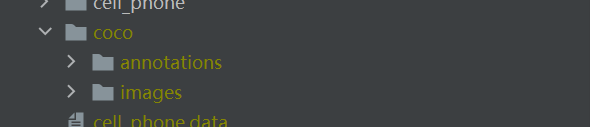

重写savetxt.py

```python
# -*- coding: utf-8 -*-
"""
Created on Fri Feb 14 13:50:34 2020

@author: user
"""

import os
import random
trainval_percent = 0.1
train_percent = 0.9
xmlfilepath = 'data/coco/annotations'
txtsavepath = 'data/coco/imageSets'
total_xml = os.listdir(xmlfilepath)
num = len(total_xml)
list = range(num)
tv = int(num * trainval_percent)
tr = int(tv * train_percent)
trainval = random.sample(list, tv)
train = random.sample(trainval, tr)
ftrainval = open('data/coco/imageSets/trainval.txt', 'w')
ftest = open('data/coco/imageSets/test.txt', 'w')
ftrain = open('data/coco/imageSets/train.txt', 'w')
fval = open('data/coco/imageSets/val.txt', 'w')
for i in list:
    name = total_xml[i][:-4] + '\n'
    if i in trainval:
        ftrainval.write(name)
        if i in train:
            ftest.write(name)
        else:
            fval.write(name)
    else:
        ftrain.write(name)
ftrainval.close()
ftrain.close()
fval.close()
ftest.close()

```

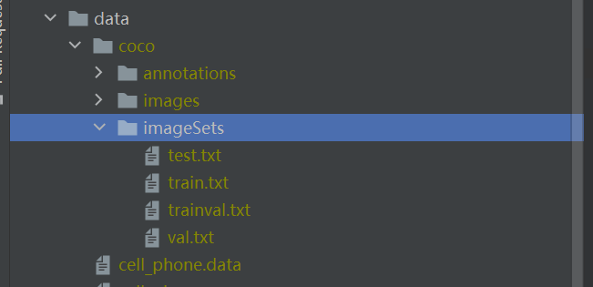

新建voc_label.py

```python
import xml.etree.ElementTree as ET
import pickle
import os
from os import listdir, getcwd
from os.path import join
sets = ['train', 'test','val']
classes = ["cell phone"]
def convert(size, box):
    dw = 1. / size[0]
    dh = 1. / size[1]
    x = (box[0] + box[1]) / 2.0
    y = (box[2] + box[3]) / 2.0
    w = box[1] - box[0]
    h = box[3] - box[2]
    x = x * dw
    w = w * dw
    y = y * dh
    h = h * dh
    return (x, y, w, h)
def convert_annotation(image_id):
    in_file = open('data/coco/annotations/%s.xml' % (image_id))
    out_file = open('data/coco/labels/%s.txt' % (image_id), 'w')
    tree = ET.parse(in_file)
    root = tree.getroot()
    size = root.find('size')
    w = int(size.find('width').text)
    h = int(size.find('height').text)
    for obj in root.iter('object'):
        difficult = obj.find('difficult').text
        cls = obj.find('name').text
        if cls not in classes or int(difficult) == 1:
            continue
        cls_id = classes.index(cls)
        xmlbox = obj.find('bndbox')
        b = (float(xmlbox.find('xmin').text), float(xmlbox.find('xmax').text), float(xmlbox.find('ymin').text),
             float(xmlbox.find('ymax').text))
        bb = convert((w, h), b)
        out_file.write(str(cls_id) + " " + " ".join([str(a) for a in bb]) + '\n')
wd = getcwd()
print(wd)
for image_set in sets:
    if not os.path.exists('data/coco/labels/'):
        os.makedirs('data/coco/labels/')
    image_ids = open('data/coco/ImageSets/%s.txt' % (image_set)).read().strip().split()
    list_file = open('data/coco/%s.txt' % (image_set), 'w')
    for image_id in image_ids:
        list_file.write('data/coco/images/%s.jpg\n' % (image_id))
        convert_annotation(image_id)
    list_file.close()

```

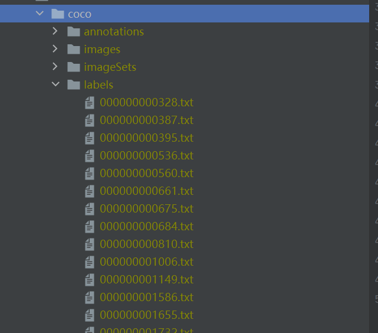

新建cell_phone.data和cell_phone.names

```shell
# cell_phone.data
train=data/coco/train.txt
valid=data/coco/test.txt
names=data/cell_phone.names
backup=backup/
classes=1
eval=coco
```

```shell
cell phone
```

修改train.py参数

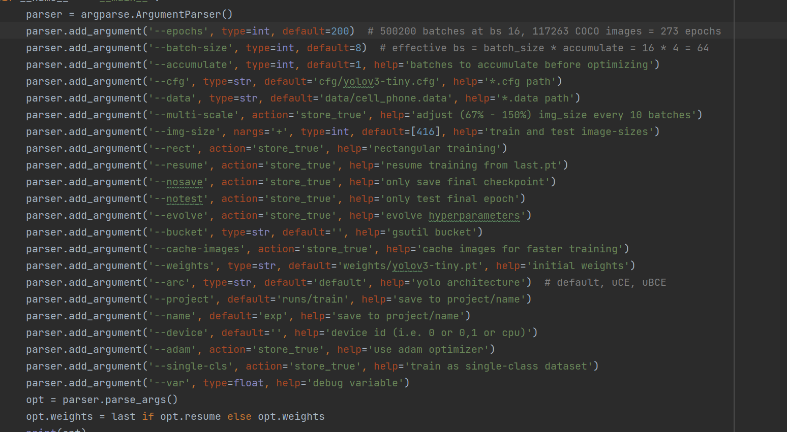

然后运行train.py

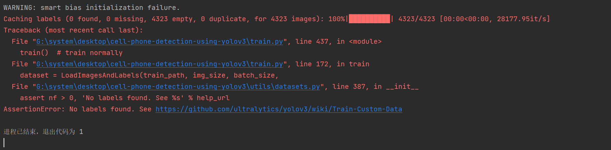

检查发现label文件是空的

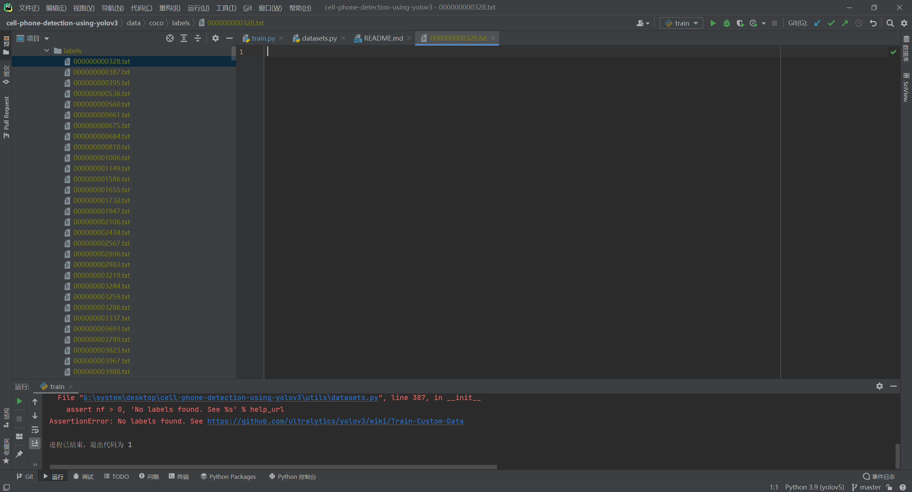

检查发现是voc_label.py代码路径写错（现已修改）

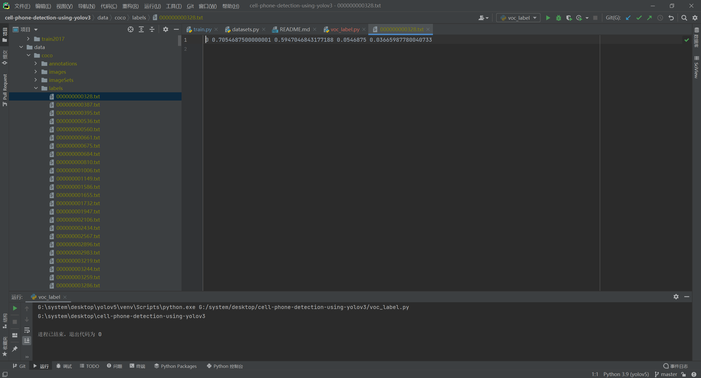

重新运行train.py

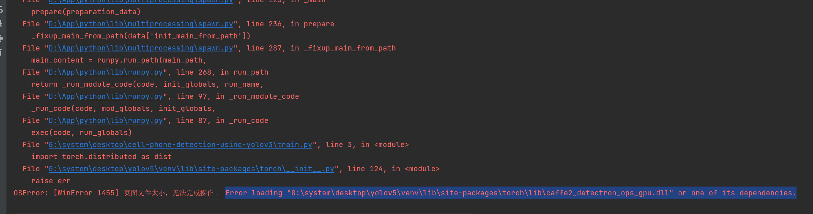

将batch-size调至1

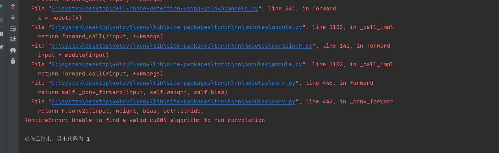

重启电脑后，batch-size设为2成功运行，开始训练模型

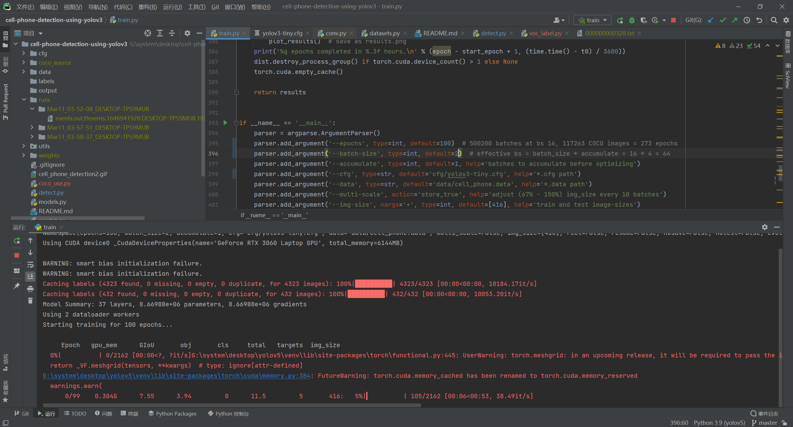

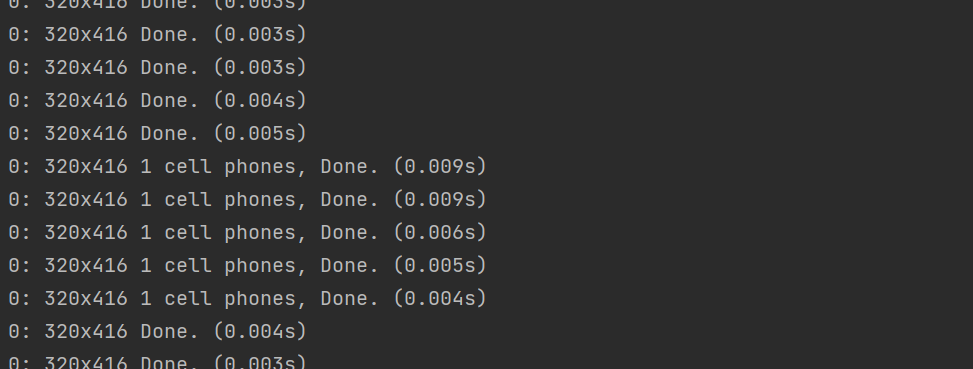

运行test后运行detect，精度及其低